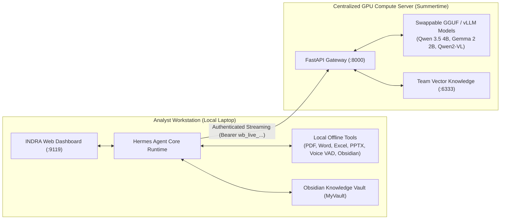

# INDRA AI Workstation — Distributed Client Setup Guide

## 1. Overview & Distributed Architecture

By default, INDRA can run in two operational modes:
1. **Local All-in-One Mode**: Both the agent workstation and the local AI models run on the same device (`127.0.0.1:8000`).
2. **Distributed Enterprise Mode (Recommended)**: The heavy GPU model serving runs on a centralized sovereign server ([Summertime Server](https://github.com/Artyfowl1710/Summertime-server)), while lightweight analyst laptops run the **INDRA Desktop Workstation** (`127.0.0.1:9119`).



### Why This Is Powerful:
- **Zero Local VRAM Required**: Analyst laptops do not need expensive NVIDIA RTX 4090 GPUs or 20GB+ of disk space for model weights.
- **Local Tool Sovereignty**: All document generation (`docx`, `pdf`, `pptx`, `xlsx`), Python script execution, offline speech-to-text / text-to-speech, and Obsidian note syncing run **locally and offline** on the client machine.
- **Dynamic Credentialing**: The server administrator issues individual, revocable API keys. No shared master keys or hardcoded endpoints.

---

## 2. Onboarding: Pairing with the Server (1 Step)

Ask your server administrator for your **Connection Packet**:
- **Server Base URL**: e.g., `http://192.168.1.100:8000` or `https://ai.internal.enterprise.com`
- **Dynamic API Key**: e.g., `wb_live_9f82a1b7c3d4e5f6a7b8c9d0e1f2a3b4`

### Automatic Single-Command Pairing
Run the pairing utility from the root directory:

```bash
# On Windows / PowerShell:
.\venv\Scripts\python.exe configure_remote_server.py --url http://192.168.1.100:8000 --key wb_live_YOUR_KEY_HERE

# Or interactive mode (it will prompt for URL and Key):
.\venv\Scripts\python.exe configure_remote_server.py
```

### What This Does Automatically:
1. Pings the server's `/v1/models` and `/v1/health` endpoints to verify network connectivity and authenticate your key.
2. Updates `SIH-26/.env` with:
   ```env
   WORKBENCH_API_BASE=http://192.168.1.100:8000
   WORKBENCH_API_KEY='wb_live_YOUR_KEY_HERE'
   OPENAI_API_KEY='wb_live_YOUR_KEY_HERE'
   OPENAI_BASE_URL='http://192.168.1.100:8000/v1'
   ```
3. Patches `SIH-26/config.yaml` to dynamically set `model.base_url` and `providers.workbench.api` to the remote server.
4. Executes a live test inference turn to guarantee token streaming is operating at full speed.

---

## 3. Starting the Client Workstation

Once paired, launch the INDRA dashboard normally:

```bash
# Using PowerShell:
.\start-dashboard.ps1

# Or using the indra CLI:
indra dashboard
```

Open your browser to `http://127.0.0.1:9119`. You can now chat, generate documents, run voice conversations, and analyze data with the full power of the GPU cluster!

---

## 4. Manual Configuration (Alternative)

If you prefer to configure the client manually:

### 1. Update `SIH-26/.env`
```env
WORKBENCH_API_BASE=http://192.168.1.100:8000
WORKBENCH_API_KEY='wb_live_YOUR_KEY_HERE'
OPENAI_API_KEY='wb_live_YOUR_KEY_HERE'
OPENAI_BASE_URL='http://192.168.1.100:8000/v1'
```

### 2. Update `SIH-26/config.yaml`
In the `model:` and `providers.workbench:` blocks, update the base URLs:
```yaml
model:
  default: indra-auto
  provider: workbench
  key_env: WORKBENCH_API_KEY
  base_url: http://192.168.1.100:8000/v1

providers:
  workbench:
    api: http://192.168.1.100:8000/v1
    base_url: http://192.168.1.100:8000/v1
    key_env: WORKBENCH_API_KEY
    transport: chat_completions
```

---

## 5. Network & Firewall Troubleshooting

| Issue | Cause | Solution |
| :--- | :--- | :--- |
| **`Connection refused` / `Timeout`** | Server firewall blocking port 8000, or wrong IP address. | Verify server IP using `ping <SERVER_IP>`. On the server, ensure port 8000 is open in firewall (`ufw allow 8000`). |
| **`401 Unauthorized`** | Expired, invalid, or mistyped API key. | Request a new key from your administrator or verify exact characters in `wb_live_...`. |
| **`Self-signed SSL certificate error`** | Server is using HTTPS with an internal CA. | The pairing script disables strict SSL verification by default for internal IP testing. For production, import the enterprise root CA into your Windows Certificate Store. |
| **Slow or laggy token streaming** | Corporate proxy or VPN inspecting SSE traffic. | Add an exception for the server IP in your corporate proxy bypass list (`NO_PROXY=192.168.1.100`). |

---

## 6. Testing Your Connection Anytime

You can verify server health and latency anytime directly from your terminal:

```bash
# Run the verification utility:
.\venv\Scripts\python.exe configure_remote_server.py --url http://192.168.1.100:8000 --key wb_live_YOUR_KEY
```
