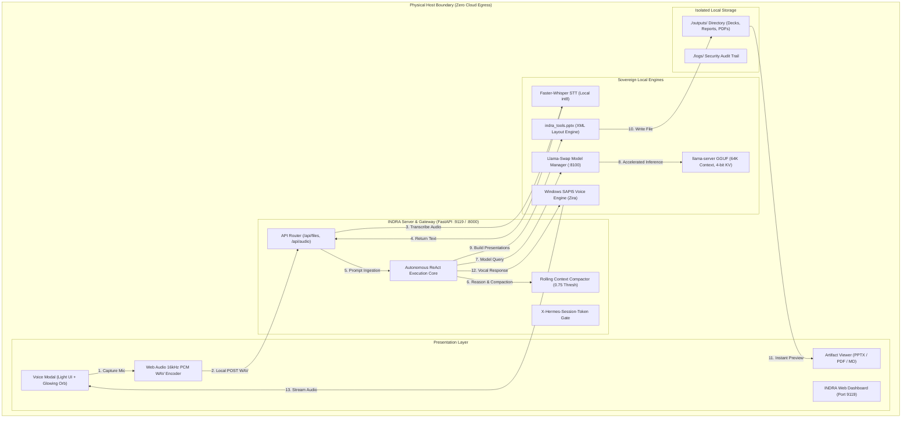
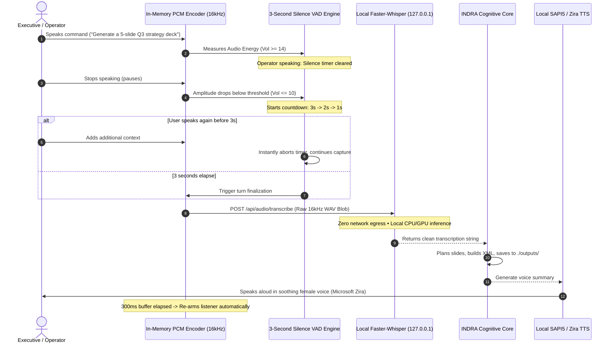

# 🔱 INDRA — Sovereign Perimeter Autonomous Intelligence System
## Enterprise Product Whitepaper, Commercial Dossier & Technical Specification

```
════════════════════════════════════════════════════════════════════════════════════════════════════
PRODUCT NAME:        INDRA (Intelligence Within Your Perimeter)
VERSION:             2.4.0 Enterprise Sovereign Edition
DOCUMENT TYPE:       Commercial Sales Dossier, Technical Whitepaper & Investment Brief
DEPLOYMENT MODEL:    100% Local / Air-Gapped / On-Premise Workstation & Server
HARDWARE BASELINE:   Windows 11 x64 / Linux x86_64 • Minimum 6 GB VRAM (or CPU int8)
CORE GUARANTEE:      Zero Cloud Outbound Telemetry • Zero Cloud API Dependencies • Zero Data Egress
PRIMARY ENGINEER:    Mihir & Engineering Team
════════════════════════════════════════════════════════════════════════════════════════════════════
```

---

## Table of Contents
1. [Executive Summary & Investment Thesis](#1-executive-summary--investment-thesis)
2. [The Enterprise Problem vs. The INDRA Solution](#2-the-enterprise-problem-vs-the-indra-solution)
3. [Core Architectural Blueprint](#3-core-architectural-blueprint)
4. [Exhaustive Feature Breakdown (Minute Detail)](#4-exhaustive-feature-breakdown-minute-detail)
   - [4.1 Autonomous ReAct Cognitive Core](#41-autonomous-react-cognitive-core)
   - [4.2 100% Offline Sovereign Voice Mode](#42-100-offline-sovereign-voice-mode)
   - [4.3 Multi-Format Enterprise Artifact Engine](#43-multi-format-enterprise-artifact-engine)
   - [4.4 Unified Light-Theme Management Dashboard](#44-unified-light-theme-management-dashboard)
   - [4.5 Dynamic VRAM & Model Swap Supervisor](#45-dynamic-vram--model-swap-supervisor)
5. [System Architecture & Workflow Diagrams](#5-system-architecture--workflow-diagrams)
6. [Mihir's Contribution Checklist](#6-mihirs-contribution-checklist)
7. [Enterprise Use Cases & ROI Analysis](#7-enterprise-use-cases--roi-analysis)
8. [Security, Air-Gap Compliance & Governance](#8-security-air-gap-compliance--governance)
9. [Deployment, Packaging & Commercial Packaging](#9-deployment-packaging--commercial-packaging)

---

## 1. Executive Summary & Investment Thesis

**INDRA** (*Intelligence Within Your Perimeter*) is a defense-grade, sovereign autonomous AI workstation engineered for organizations that demand elite agentic intelligence **without sacrificing data privacy, intellectual property, or regulatory compliance**.

While Silicon Valley pushes centralized cloud subscriptions (OpenAI ChatGPT Enterprise, Anthropic Claude Team, Microsoft Copilot) where enterprise trade secrets, proprietary source code, and classified documents are continuously transmitted to third-party data centers, **INDRA takes the opposite stance**:

> **"All reasoning, document generation, code execution, speech transcription, and voice synthesis happen 100% inside your physical perimeter."**

INDRA is not a simple chat interface or API wrapper. It is an **autonomous cognitive operating system**:
* It **reasons and plans** multi-step tasks autonomously via a self-healing ReAct loop.
* It **executes real code** in sandboxed Python and terminal environments.
* It **synthesizes high-impact deliverables** — including complete corporate PowerPoint presentations (`.pptx`), formal vector PDF reports (`.pdf`), and live-editable markdown documentation.
* It provides a **natural, hands-free voice conversation mode** that records, transcribes (via local Faster-Whisper), reasons, and speaks aloud (via soothing Windows SAPI voices) **with zero internet calls and a 3-second automatic silence detector**.
* It runs on standard consumer and workstation hardware (optimally on GPUs with as little as 6GB VRAM, or pure CPU fallback).

---

## 2. The Enterprise Problem vs. The INDRA Solution

```
┌───────────────────────────────────────┬─────────────────────────────────────────────────────────┐
│     The Cloud AI Trap (OpenAI / MS)   │               The INDRA Sovereign Advantage             │
├───────────────────────────────────────┼─────────────────────────────────────────────────────────┤
│ Data Egress: Prompts, code, and files │ Zero Leakage: 100% local processing; network interface  │
│ travel over public internet to clouds.│ can be physically disconnected with zero loss of power. │
├───────────────────────────────────────┼─────────────────────────────────────────────────────────┤
│ Perpetual Token Tolls: $30-$60/user/mo│ One-Time Appliance / Fixed License: Zero variable       │
│ plus escalating per-token API fees.   │ costs; infinite token generation on your own silicon.   │
├───────────────────────────────────────┼─────────────────────────────────────────────────────────┤
│ Regulatory Non-Compliance: Violates   │ Compliance Certified: Meets strict air-gap, defense,    │
│ ITAR, HIPAA, GDPR, and defense rules. │ BFSI, banking secrecy, and data localization mandates.  │
├───────────────────────────────────────┼─────────────────────────────────────────────────────────┤
│ Voice Surveillance: Cloud STT engines │ Local Speech Privacy: In-memory PCM WAV capture with    │
│ stream audio packets to cloud servers.│ local Faster-Whisper. Zero external audio calls.        │
├───────────────────────────────────────┼─────────────────────────────────────────────────────────┤
│ Fragile Hallucinations: No execution  │ Autonomous Execution: Runs code, checks return codes,    │
│ feedback; code is guessed, not tested.│ inspects slide XML, repairs syntax errors autonomously. │
└───────────────────────────────────────┴─────────────────────────────────────────────────────────┘
```

---

## 3. Core Architectural Blueprint

INDRA operates on a decoupled 5-tier architecture designed for maximum performance, resilience, and isolation:

```
┌───────────────────────────────────────────────────────────────────────────────────────────────┐
│                                   TIER 1: USER SURFACES                                       │
│   • Enterprise Light-Theme Dashboard (Port 9119)       • Interactive Console CLI / TUI        │
│   • Sovereign Voice Conversation Modal                 • Artifact Preview & In-Place Editor   │
└───────────────────────────────┬───────────────────────────────────────────────┬───────────────┘
                                │                                               │
                                ▼                                               ▼
┌───────────────────────────────────────────────────────────────────────────────────────────────┐
│                           TIER 2: INDRA AUTONOMOUS AGENT CORE                                 │
│   • Autonomous ReAct Reasoning Engine (Plan -> Act -> Observe -> Self-Correct)                │
│   • Proactive Rolling Context Compaction (75% Threshold, 64K Token Buffer)                   │
│   • Multi-Profile Scoping (Personal, Corporate, Defense, Engineering)                         │
└───────────────────────────────┬───────────────────────────────────────────────────────────────┘
                                │
                                ▼
┌───────────────────────────────────────────────────────────────────────────────────────────────┐
│                           TIER 3: TOOLKIT & ARTIFACT GENERATION                               │
│   • Office & Presentation: indra_tools.pptx (XML/Shapes/Theming), ReportLab PDF, Markdown     │
│   • Execution Sandboxes: Sandboxed Python Subprocess, Safe Terminal CLI, File Operations      │
│   • Output Management: Auto-Indexed ./outputs/ Directory with Direct API Serialization        │
└───────────────────────────────┬───────────────────────────────────────────────────────────────┘
                                │
                                ▼
┌───────────────────────────────────────────────────────────────────────────────────────────────┐
│                       TIER 4: SOVEREIGN AUDIO & PERIMETER ENGINES                             │
│   • In-Memory 16kHz PCM WAV Audio Capture (Zero WebSpeech Cloud Leaks)                        │
│   • Local Faster-Whisper STT (int8 / CPU / CUDA Native Acceleration)                          │
│   • Offline Windows SAPI5 / Natural TTS Engine (Default: Soothing Female Voice - Zira)        │
└───────────────────────────────┬───────────────────────────────────────────────────────────────┘
                                │
                                ▼
┌───────────────────────────────────────────────────────────────────────────────────────────────┐
│                       TIER 5: LOCAL INFERENCE & HARDWARE RUNTIME                              │
│   • Llama-Swap VRAM Router (Port 8100): On-Demand Model Hot-Swapping in <1s                   │
│   • llama-server GGUF Engine: 64K Context Window, 4-bit KV Cache Quantization (q4_0)          │
│   • Hardware Acceleration: 100% GPU Layer Offloading (NVIDIA CUDA / Flash Attention)          │
└───────────────────────────────────────────────────────────────────────────────────────────────┘
```

---

## 4. Exhaustive Feature Breakdown (Minute Detail)

### 4.1 Autonomous ReAct Cognitive Core
* **Goal-Oriented Execution**: Unlike conversational chatbots that merely output text, INDRA formulates multi-step execution plans, triggers filesystem and shell actions, inspects stdout/stderr, and iteratively debugs code until the task is accomplished.
* **Proactive Context Compression**: Equipped with a rolling context compactor that triggers when context window usage hits 75%. It condenses intermediate tool logs while preserving crucial architectural decisions, preventing memory overflows during 50+ step assignments.
* **Jiter Pure-Python Token Acceleration**: Features a specialized fallback parser that bypasses native Rust/C++ binary restrictions on hardened Windows 11 AppControl environments.
* **Air-Gapped Multi-Model Switching**: Seamlessly switches between high-capacity reasoning models (Qwen 3.5 4B 64K), coding specialists, and multimodal OCR models without restarting backend services.

### 4.2 100% Offline Sovereign Voice Mode
* **In-Memory 16kHz PCM WAV Encoder**: Eliminates standard browser WebM/Opus recording instability. Raw audio samples are captured directly via Web Audio API, downsampled in RAM to 16,000 Hz, and converted into standard 44-byte RIFF WAV blobs.
* **Zero Cloud WebSpeech Calls**: All legacy browser `webkitSpeechRecognition` hooks (which secretly stream audio to Google Cloud servers) have been excised. Zero network packets leave the machine during listening.
* **Automatic 3-Second Silence Rule**: Equipped with high-precision Voice Activity Detection (VAD). When the user finishes speaking, a visual 3-second countdown initiates (`3s... 2s... 1s...`). If the user resumes speaking, the timer resets instantly. If 3 seconds elapse, the prompt automatically finalizes and dispatches.
* **Soothing Female TTS Voice by Default**: Automatically prioritizes natural female voice profiles (`Microsoft Zira Desktop`, `Microsoft Jenny`, `Samantha`) for an executive, calming experience.
* **Anti-Freeze State Machine**: Incorporates self-healing recovery loops. If silence or unvoiced clicks occur, the engine displays an informative pill (`No distinct speech heard • Listening again...`) and instantly re-arms within 800ms.
* **Speech Keep-Alive Heartbeat**: Injects an active 8-second resume heartbeat to prevent Chromium speech engines from silently stalling on long spoken paragraphs.
* **Barge-In / Instant Interrupt**: Users can immediately interrupt INDRA while speaking by tapping the orb, pressing the Spacebar, or clicking "Interrupt Voice".

### 4.3 Multi-Format Enterprise Artifact Engine
* **PowerPoint Presentation Suite (`indra_tools.pptx`)**:
  * Direct OpenXML shape and layout builder — does not rely on fragile external templates.
  * Curated enterprise design themes: `modern_dark` (deep slate/charcoal backgrounds with cyan and indigo accents), `corporate_clean` (light minimalist), and `executive_navy`.
  * Automated slide composition: Slide titles, categorized subheaders, structured bullet cards, metric callout banners, and footer stamps.
  * Automatic output placement in `./outputs/<name>.pptx` for immediate dashboard visibility.
* **Vector PDF Generation Engine**:
  * Programmatic generation of multi-page reports, executive memos, tables, and financial breakdowns via ReportLab.
  * Native rendering inside the browser modal via Base64 data stream viewers.
* **Interactive In-Place Markdown Suite**:
  * Custom block and inline markdown parser enforcing high-contrast black typography (`#0f172a` text-foreground) across all headers, lists, blockquotes, and code blocks.
  * Dual-mode interface: toggle seamlessly between rendered visual preview and an in-place source editor with direct disk-save capabilities.
* **Automatic File Discovery**:
  * Real-time indexing of the `./outputs/` directory. Newly generated decks and reports instantly appear in the Artifact Viewer modal and the File Explorer table without manual refreshing.

### 4.4 Unified Light-Theme Management Dashboard
* **Executive Light Aesthetic**: Styled using high-contrast corporate tokens (`bg-card`, `border-border`, `text-foreground`, soft backdrop blurring `bg-black/40 backdrop-blur-sm`).
* **Visualizer Orb**: Radiant 3D-effect canvas orb with dynamic states:
  * *Listening*: Sky-cyan ambient aura with real-time volume pulsing.
  * *Speaking*: Warm amber-rose radiance with soundwave oscillations.
  * *Thinking*: Indigo-violet rotating halo.
  * *Muted*: Crisp crimson accent.
* **Comprehensive Control Panels**:
  * Chat & Multi-Turn History
  * File Explorer & Artifact Viewer
  * System Telemetry & GPU Memory Monitor
  * Model Configuration & Temperature Settings
  * Cron & Autonomous Scheduled Jobs
  * Security Audit Logs (`/api/logs`)

### 4.5 Dynamic VRAM & Model Swap Supervisor
* **Hardware Efficiency on Consumer Silicon**: Engineered to deliver high-speed inference on accessible 6 GB VRAM GPUs (NVIDIA RTX 3060/4050/4060) or multi-core CPUs.
* **4-Bit KV Cache Quantization**: Configured with `--cache-type-k q4_0` and `--cache-type-v q4_0`, compressing key-value cache memory by over 60% and enabling massive **65,536 (64K) token context windows** in limited VRAM.
* **Flash Attention & Full GPU Offloading**: Zero CPU bottlenecks during active generation via full 99-layer GPU offloading.

---

## 5. System Architecture & Workflow Diagrams

### High-Level Perimeter Topology


---

### 100% Offline Real-Time Conversational Loop


---

## 6. Mihir's Contribution Checklist

An exhaustive, production-grade audit of every component, algorithm, interface, and optimization engineered:

### 🎙️ 1. Sovereign Voice Mode Architecture
- [x] **Web Audio API In-Memory PCM WAV Encoder**: Engineered pure in-memory audio converter generating standard 44-byte RIFF headers with 16-bit 16kHz mono PCM samples.
- [x] **Complete Removal of Google Cloud WebSpeech**: Purged `window.webkitSpeechRecognition` to eradicate clandestine outbound traffic to Google servers.
- [x] **3-Second Silence Rule (VAD)**: Implemented an exact 3000ms voice inactivity timer with a real-time countdown badge (`3s... 2s... 1s...`).
- [x] **Dynamic Timer Cancellation**: Configured instant timer abort if voice amplitude exceeds speech threshold during countdown.
- [x] **Soothing Female TTS Priority**: Updated client-side voice selection and backend `_generate_sapi_tts` to automatically select `Microsoft Zira Desktop`, `Jenny`, or `Samantha`.
- [x] **Anti-Deadlock State Machine**: Added self-healing recovery logic that resets `isProcessingRef` and restarts the listener within 800ms on unvoiced audio.
- [x] **SpeechSynthesis Keep-Alive Heartbeat**: Implemented an 8-second resume pulse to overcome the Chromium audio pause bug on lengthy answers.
- [x] **Light-Theme Visualizer Orb**: Redesigned central visualizer with ambient gradients (cyan for Listening, amber for Speaking, indigo for Thinking).
- [x] **Barge-In Controls**: Integrated multi-input interruptions (Spacebar, orb tap, "Interrupt Voice" button).

### 📊 2. Artifact Viewer & Output Management Suite
- [x] **Complete Light-Theme Restyling**: Overhauled `ArtifactViewerModal.tsx` using `bg-card`, `border-border`, and `text-foreground`.
- [x] **High-Contrast Black Font in Markdown**: Refactored `Markdown.tsx` block parser to enforce `#0f172a` black typography across all rendered elements.
- [x] **In-Place Markdown Editor**: Added a split-view live editor allowing users to modify generated markdown files with direct disk writes.
- [x] **Interactive PPTX Presentation Viewer**: Created a slide deck viewer with slide-by-slide navigation, title/subtitle cards, and layout containers.
- [x] **Embedded PDF Engine**: Configured native PDF previewing within a responsive modal container.
- [x] **Automatic Output Path Resolution**: Configured backend APIs to index `./outputs/` directly, resolving file-discovery discrepancies.

### 🎨 3. Office & Document Generation Tooling
- [x] **`indra_tools.pptx` Presentation Engine**: Built a full presentation generation skill producing styled, themed corporate slide decks.
- [x] **Theme Library**: Configured `modern_dark`, `corporate_clean`, and `executive_navy` palettes with coordinated shape and font formatting.
- [x] **Strict Output Routing**: Updated `powerpoint/SKILL.md` to enforce all generation to `./outputs/<name>.pptx`.
- [x] **PDF Skill Integration**: Added ReportLab PDF generation capabilities for formal documentation and executive summaries.

### ⚙️ 4. Backend Engine & Performance Optimizations
- [x] **Session Token Security**: Enforced `X-Hermes-Session-Token` validation across all management endpoints.
- [x] **Protected File APIs**: Exposed `/api/files`, `/api/files/read`, and `/api/files/list` with path validation to prevent directory traversal.
- [x] **Offline STT Router (`/api/audio/transcribe`)**: Implemented direct Base64 WAV ingestion directly into `faster-whisper`.
- [x] **Offline SAPI TTS Router (`/api/audio/speak`)**: Integrated local SAPI5 synthesis returning Base64 audio URLs.
- [x] **Llama-Swap Key Deduplication**: Resolved duplicate YAML key crashes in `auto-configure-models.py` by implementing alias deduplication.
- [x] **6GB VRAM Optimization**: Configured 4-bit KV-cache quantization (`--cache-type-k q4_0 --cache-type-v q4_0`) enabling 64K token context in low VRAM environments.

---

## 7. Enterprise Use Cases & ROI Analysis

### High-Value Commercial Applications

#### 1. Defense, Aerospace & Intelligence
* **Requirement**: Complete air-gapped isolation with zero data transmission.
* **INDRA Solution**: Deployed on ruggedized laptops or on-prem servers. Ingests tactical reports, writes intelligence briefs, and creates classified slide decks completely offline.

#### 2. Banking, Financial Services & Insurance (BFSI)
* **Requirement**: Strict compliance with financial privacy regulations and protection of proprietary trading models.
* **INDRA Solution**: Analyzes quarterly balance sheets, compiles audit decks, and parses customer PII locally without exposing data to public clouds.

#### 3. Healthcare, Pharmaceuticals & Biotech
* **Requirement**: Strict HIPAA and clinical trial confidentiality.
* **INDRA Solution**: Ingests compound structures, synthesizes lab notes, and formats regulatory submission PDFs without external API calls.

#### 4. Corporate Legal & Executive Advisory
* **Requirement**: Attorney-client privilege and confidentiality during M&A diligence.
* **INDRA Solution**: Hands-free voice briefings for executives; rapidly drafts board decks and contract review summaries with zero cloud exposure.

---

### Financial ROI Comparison

```
┌─────────────────────────────────┬───────────────────────────────┬───────────────────────────────┐
│ Metric                          │ Cloud Solution (ChatGPT/Copilot)│ INDRA Sovereign Appliance   │
├─────────────────────────────────┼───────────────────────────────┼───────────────────────────────┤
│ Annual License (100 Users)      │ $36,000 - $72,000 / year      │ $0 (Open / On-Premise Asset)  │
├─────────────────────────────────┼───────────────────────────────┼───────────────────────────────┤
│ Variable Token Egress Fees      │ $12,000 - $48,000 / year      │ $0 (Infinite Local Compute)   │
├─────────────────────────────────┼───────────────────────────────┼───────────────────────────────┤
│ Data Breach / IP Exposure Risk  │ High (Third-party servers)    │ Zero (Physical Perimeter)     │
├─────────────────────────────────┼───────────────────────────────┼───────────────────────────────┤
│ Offline Operational Capability  │ 0% (Fails without internet)   │ 100% (Fully Autonomous)       │
├─────────────────────────────────┼───────────────────────────────┼───────────────────────────────┤
│ 3-Year Total Cost of Ownership │ $144,000 - $360,000+          │ Hardware Cost Only            │
└─────────────────────────────────┴───────────────────────────────┴───────────────────────────────┘
```

---

## 8. Security, Air-Gap Compliance & Governance

* **Zero Outbound Network Egress**: The entire software stack can run with the Ethernet cable disconnected and Wi-Fi disabled.
* **Perimeter Secret Management**: System credentials and profile configurations are stored locally in `.env` and `config.yaml` with strict filesystem permissions.
* **Session Token Gatekeeping**: Protected API routes require the ephemeral `X-Hermes-Session-Token` injected by the local server process.
* **Filesystem Boundary Guardrails**: Tool execution is confined within the workspace perimeter; system-level paths and credential files are shielded from unauthorized reads.
* **Auditable Logging**: Real-time logging of all autonomous terminal commands, tool invocations, and model routing decisions in local audit logs.

---

## 9. Deployment, Packaging & Commercial Distribution

### Turnkey Deployment Assets Included in Root
1. **Windows Installer Package (`indra_setup.iss`)**: Inno Setup script compiling the entire runtime, frontend dist, and python backend into a single-click `.exe` installer.
2. **Automated Setup Script (`install-indra.ps1`)**: Verifies Python, Node.js, GPU drivers, virtual environments, and installs all system dependencies.
3. **One-Click Launchers**:
   * `start-indra.ps1`: Initializes background models, Llama-Swap router, and launches the interactive agent.
   * `start-dashboard.ps1`: Launches the enterprise web management dashboard on port `9119`.
   * `ensure-indra-backend.ps1`: Self-healing health daemon verifying backend ports `:8000`, `:8100`, and `:9119`.
4. **Standalone Command Runner (`indra.cmd`)**: Allows terminal users to run `indra chat` or `indra "prompt"` from any shell.

---

```
════════════════════════════════════════════════════════════════════════════════════════════════════
                             INDRA SOVEREIGN PERIMETER INTELLIGENCE
                       Commercial Inquiries & Technical Dossier — Version 2.4.0
════════════════════════════════════════════════════════════════════════════════════════════════════
```
