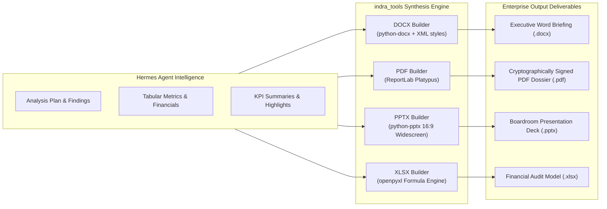

# INDRA Offline Document Synthesis Engine (`indra_tools`)

> **Classification**: Enterprise Technical Architecture & Document Engineering Specification  
> **Target Subsystem**: `SIH-26/indra_tools/` (`docx.py`, `pdf.py`, `pptx.py`, `xlsx.py`, `cli.py`)  
> **Security Perimeter**: 100% Offline Air-Gapped Operation (Zero External API Calls, Zero Telemetry)

---

## 1. Engine Philosophy & Executive Purpose

Standard LLM toolkits generate crude text or markdown blocks, forcing analysts to manually format deliverables into executive-ready documents. INDRA incorporates a native, sovereign document synthesis engine (`indra_tools`) that programmatically compiles rich, publication-grade corporate deliverables directly from structured agent data:



---

## 2. Format Specifications & Technical Implementation

### 2.1 Microsoft Word Synthesis (`indra_tools.docx`)
The DOCX engine constructs documents adhering to modern corporate publishing standards rather than basic default styles:
- **Typography**: Primary typeface `Segoe UI` or `Calibri`, paired with geometric headings in Navy `#1B365D`.
- **Structured Title Page / Header**: Automated document metadata block with dynamic classification badges (e.g., `CONFIDENTIAL // INTERNAL EYES ONLY`).
- **Data Tables**: Zebra-striped rows (`#F4F6F9`), bold headers with `#1B365D` fills, cell padding, and explicit column widths.
- **Callout Cards**: Left-bordered accent boxes (`#2563EB`) with italicized summary takeaways.
- **Headers & Footers**: Right-aligned dynamic page numbers and running document title.

```python
from indra_tools.docx import create_executive_docx

doc_path = create_executive_docx(
    title="Q3 Strategic Infrastructure Assessment",
    subtitle="Air-Gapped Sovereign AI Deployment Metrics",
    author="INDRA Analyst System",
    classification="CONFIDENTIAL",
    sections=[
        {"heading": "Executive Summary", "content": "The deployment completed with zero network leaks..."},
        {"heading": "Hardware Utilization", "table_data": [
            ["Node ID", "GPU Model", "VRAM Used", "Latency (ms)"],
            ["NODE-01", "NVIDIA RTX 4090", "18.4 GB", "116ms"],
            ["NODE-02", "NVIDIA A100", "34.2 GB", "84ms"]
        ]}
    ],
    output_path="outputs/reports/Q3_Assessment.docx"
)
```

---

### 2.2 Adobe PDF Publishing (`indra_tools.pdf`)
The PDF engine is engineered using ReportLab's **Platypus (Page Layout and Typography Using Scripts)** flowable architecture:
- **Two-Pass Canvas Numbering**: Implements a custom canvas (`NumberedCanvas`) that computes total page count dynamically (`Page X of Y`).
- **Color Palette**:
  - `Primary`: Midnight Blue `#0F172A`
  - `Brand Accent`: Royal Cobalt `#2563EB`
  - `Neutral Background`: Ice Tint `#F8FAFC`
  - `Rule Divider`: Slate Accent `#E2E8F0`
- **Dynamic Table of Contents & Headings**: Structured bookmarks and heading anchors embedded in the PDF outline tree.
- **Security**: No external fonts downloaded; relies on embedded Core 14 PostScript typefaces (Helvetica, Times, Courier) or system TrueType fonts.

---

### 2.3 PowerPoint Presentation Engine (`indra_tools.pptx`)
Engineered for boardroom presentations using a 16:9 widescreen canvas ($13.333 \times 7.5$ inches):
- **Executive Card Layout**: Unlike default PowerPoint templates with bulleted text boxes, INDRA creates modular **visual cards** with subtle drop shadows and borders.
- **Key Metric KPI Callouts**: Special high-impact stat cards with 44pt bold numbers and 12pt uppercase metric labels (e.g. `116ms - P95 INFERENCE LATENCY`).
- **Palette Presets**:
  - `Corporate Light`: Clean white background, slate text, cobalt accents.
  - `Executive Dark`: Deep Obsidian `#090D16`, glowing emerald/cyan metric pills.

```python
from indra_tools.pptx import PresentationBuilder

deck = PresentationBuilder(widescreen=True)
deck.add_title_slide(
    title="Project INDRA: Sovereign AI Workstation",
    subtitle="Enterprise Deployment Architecture & Performance Benchmarks",
    date="October 2026"
)
deck.add_kpi_slide(
    title="System Performance Highlights",
    kpis=[
        {"value": "100%", "label": "Offline Sovereign Execution"},
        {"value": "116ms", "label": "Time-To-First-Token"},
        {"value": "9 Models", "label": "Dynamic VRAM Eviction Pool"}
    ]
)
deck.save("outputs/presentations/Indra_Briefing.pptx")
```

---

### 2.4 Microsoft Excel Financial & Analytical Engine (`indra_tools.xlsx`)
Financial and quantitative audits demand real spreadsheet intelligence, not just flat CSV exports:
- **Formula Support**: Dynamic Excel formulas (`SUM`, `AVERAGE`, `COUNTIF`, `VLOOKUP`) injected directly into cells.
- **Formatting Engines**:
  - Currency: `_($* #,##0.00_)`
  - Percentages: `0.0%`
  - Date: `YYYY-MM-DD`
- **Auto-Fit Column Widths**: Algorithms scan maximum string lengths across all rows and adjust column widths plus safety padding.
- **Auto-Filter & Freeze Panes**: Automatically freezes header rows and activates Excel autofilter dropdowns on all tabular ranges.

---

## 3. Command Line Interface (CLI)

The `indra_tools` package provides a standalone CLI that can be called from shell scripts or agent sub-processes:

```bash
# Generate an executive PDF briefing
python -m indra_tools.cli pdf --title "Threat Briefing" --input data/findings.json --out outputs/briefing.pdf

# Generate a 16:9 PPTX deck
python -m indra_tools.cli pptx --title "Quarterly Review" --input data/metrics.json --out outputs/review.pptx

# Generate an Excel audit model
python -m indra_tools.cli xlsx --title "Cloud vs Sovereign Cost Model" --input data/costs.json --out outputs/costs.xlsx
```

---

## 4. Verification and Self-Test

The integrity of the document synthesis pipeline is validated automatically via `verify_indra_system.py`:
```powershell
python verify_indra_system.py
```
Checks verified:
- `[PASS]` `python-docx` availability and style generation
- `[PASS]` `reportlab` canvas flowable compilation
- `[PASS]` `python-pptx` 16:9 geometry creation
- `[PASS]` `openpyxl` formula calculation and cell formatting
- `[PASS]` End-to-end document output rendering to `outputs/healthcheck/`
