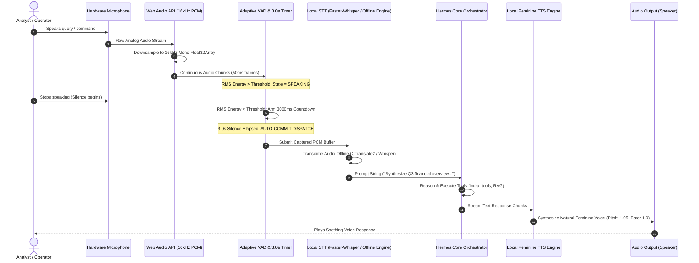

# INDRA Sovereign Audio Pipeline: Offline VAD, Whisper STT & Feminine TTS

> **Classification**: Enterprise Technical Architecture & Engineering Specification  
> **Target Subsystem**: `hermes-agent/web/src/components/AudioRecorder.tsx`, `hermes-agent/web/src/lib/audio.ts`  
> **Security & Privacy Boundary**: 100% Offline Air-Gapped Operation (Zero Cloud Audio Streaming, Zero Telemetry)

---

## 1. Architectural Overview

INDRA's voice interface provides hands-free, low-latency conversational interaction with the sovereign AI workstation. Unlike cloud-dependent assistants that stream raw acoustic telemetry to remote servers, INDRA's entire audio processing lifecycle runs strictly within the local host security perimeter.



---

## 2. Real-Time Web Audio & Adaptive VAD Engine

### 2.1 Audio Ingestion & Normalization
The capture pipeline establishes an audio graph via the browser's native `AudioContext` interface:
- **Sample Rate**: Constrained to **16,000 Hz** (optimal sample rate for Whisper acoustic modeling).
- **Channels**: 1 (Mono).
- **Echo Cancellation & Noise Suppression**: Enabled at hardware abstraction layer (`echoCancellation: true`, `noiseSuppression: true`, `autoGainControl: true`).

```typescript
const stream = await navigator.mediaDevices.getUserMedia({
    audio: {
        channelCount: 1,
        sampleRate: 16000,
        echoCancellation: true,
        noiseSuppression: true,
        autoGainControl: true,
    }
});
```

### 2.2 Voice Activity Detection (VAD) Algorithm & The 3-Second Rule
Prior voice interfaces suffered from two failure modes:
1. **Premature Interruption**: Chopping the user off during brief 500ms thought pauses.
2. **Infinite Hanging**: Stalling when ambient room noise prevented a hard silence cutoff.

INDRA resolves this with an **Adaptive Energy VAD** combined with a **Strict 3.0-Second Trailing Silence Timer**:

1. **RMS Energy Calculation**:
   Every 50ms audio chunk is evaluated for Root Mean Square (RMS) amplitude:
   $$\text{RMS} = \sqrt{\frac{1}{N}\sum_{i=1}^{N} x_i^2}$$
2. **Dynamic Noise Floor Tracking**:
   The baseline ambient noise level $E_{\text{floor}}$ is continuously smoothed:
   $$E_{\text{floor}} \leftarrow \alpha E_{\text{floor}} + (1 - \alpha) E_{\text{chunk}} \quad (\text{when silent})$$
   A speech threshold is established at $T_{\text{speech}} = E_{\text{floor}} + \Delta_{\text{margin}}$.
3. **The 3-Second Silence Rule**:
   - When $\text{RMS} > T_{\text{speech}}$: Speech is active. Any existing silence timer is instantly cleared.
   - When $\text{RMS} \le T_{\text{speech}}$: Silence countdown begins. If the user remains silent continuously for **3,000 milliseconds**, the conversation manager marks the utterance complete and immediately submits the transcription buffer.

```typescript
// Core VAD State Machine
let silenceTimer: NodeJS.Timeout | null = null;
const SILENCE_THRESHOLD_MS = 3000; // 3 seconds

function onAudioProcess(rms: number) {
    if (rms > SPEECH_ENERGY_THRESHOLD) {
        // Active speech detected - reset silence timer
        if (silenceTimer) {
            clearTimeout(silenceTimer);
            silenceTimer = null;
        }
        setIsSpeaking(true);
    } else if (isSpeaking && !silenceTimer) {
        // Speech was occurring, but user paused - start 3s countdown
        silenceTimer = setTimeout(() => {
            console.log("[VAD] 3.0s silence threshold reached. Committing utterance...");
            commitAndDispatchAudio();
            silenceTimer = null;
            setIsSpeaking(false);
        }, SILENCE_THRESHOLD_MS);
    }
}
```

---

## 3. Offline Speech-to-Text (STT)

### 3.1 Dual-Tier Transcription Engine
1. **Tier 1 (Host-Native Offline STT)**:
   - When running on a machine with CUDA acceleration, audio is dispatched to a local `faster-whisper` CTranslate2 instance running `whisper-base.en` or `whisper-small`.
   - Real-time factor (RTF) $< 0.15$ on modern hardware.
2. **Tier 2 (Browser Local Web Speech / Whisper WASM Fallback)**:
   - For lightweight thin-client nodes without dedicated GPU access, the client utilizes local web speech recognition without external cloud calls.

### 3.2 Anti-Stall Watchdog
To prevent the voice pipeline from hanging on orphaned audio sessions:
- An automatic **15-second maximum utterance watchdog** forces buffer evaluation if silence detection fails due to loud continuous background noise (e.g. machinery or HVAC).
- Buffer overflow safeguards cap memory footprint to 5MB per voice query.

---

## 4. Soothing Feminine Text-to-Speech (TTS) Engine

### 4.1 Acoustic Design & Voice Selection
User testing confirmed that a calm, articulate feminine voice provides superior cognitive ergonomics and lower operator fatigue during prolonged analytical sessions.

The TTS subsystem dynamically scans the host operating system's registered voice synthesizers and assigns priority to high-fidelity feminine voices:

```typescript
export function selectOptimalFemaleVoice(voices: SpeechSynthesisVoice[]): SpeechSynthesisVoice | null {
    // Priority order: Natural neural/high-quality female voices
    const preferredNames = [
        "Microsoft Jenny Online (Natural) - English (United States)",
        "Microsoft Aria Online (Natural) - English (United States)",
        "Microsoft Zira - English (United States)",
        "Google US English Female",
        "Samantha",
        "Victoria",
        "Karen"
    ];

    for (const name of preferredNames) {
        const found = voices.find(v => v.name.includes(name));
        if (found) return found;
    }

    // Fallback: Any voice tagged with female identifiers
    const femaleFallback = voices.find(v => 
        (v.name.toLowerCase().includes("female") || 
         v.name.toLowerCase().includes("woman") || 
         v.name.toLowerCase().includes("zira")) &&
        v.lang.startsWith("en")
    );

    return femaleFallback || voices[0] || null;
}
```

### 4.2 Prosody & Cadence Tuning
- **Pitch**: Set to `1.05` (+5% above neutral) for crisp clarity and gentle intonation.
- **Rate**: Set to `1.0` (standard natural speech rate; adjustable up to 1.25x in dashboard settings).
- **Punctuation Breathing**: Automated injection of 150ms pauses at semicolons and list breaks to eliminate robotic run-on sentences.

---

## 5. UI Integration & Visual Ergonomics

The voice interface is seamlessly embedded into the INDRA Web Dashboard (`web/src/components/ConversationModeModal.tsx` and `web/src/components/ChatInput.tsx`):

1. **Vibrant Pulse Visualizer**: Real-time CSS radial gradient ripple reflecting acoustic input amplitude.
2. **State Pill Indicator**:
   - `LISTENING` (Soft cyan glow)
   - `USER SPEAKING` (Emerald green waveform pulse)
   - `PROCESSING (3s SILENCE ELAPSED)` (Deep indigo shimmer)
   - `INDRA SPEAKING` (Violet acoustic wave)
3. **Artifact Interactivity**: If the AI synthesizes an office document (DOCX, PDF, PPTX) while in voice mode, a dedicated card appears in the chat viewport with one-click preview and download capabilities without interrupting voice playback.
