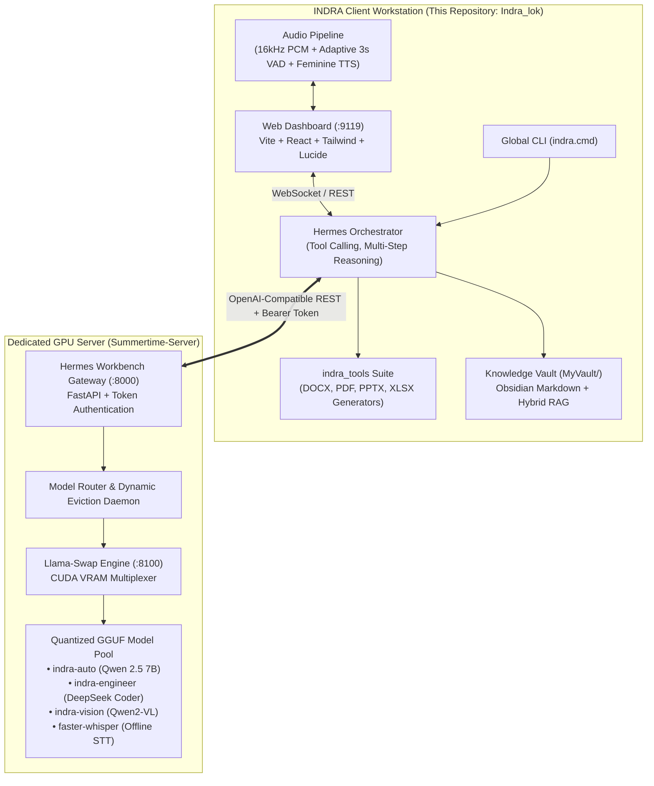

# INDRA: Sovereign Enterprise AI Workstation & Analyst Client

<div align="center">


<br/>

**The complete client workstation and analyst interface for the INDRA sovereign AI ecosystem.**  
*Native host execution, real-time voice with 3-second silence detection, offline office document synthesis, Obsidian knowledge vault RAG, and dynamic pairing with distributed GPU model servers.*

---

### 🔗 Companion GPU Inference Infrastructure
INDRA decouples heavy compute from the analyst workstation. The backend model serving daemon, smart persona router, and Llama-Swap VRAM manager are maintained at:  
👉 **[Artyfowl1710 / Summertime-server](https://github.com/Artyfowl1710/Summertime-server)**

---

</div>

## 📑 Table of Contents
1. [System Architecture](#-system-architecture)
2. [Key Capabilities](#-key-capabilities)
3. [Quickstart & Installation](#-quickstart--installation)
4. [Connecting to GPU Compute Server](#-connecting-to-gpu-compute-server)
5. [Voice & Audio Pipeline](#-voice--audio-pipeline)
6. [Offline Document Synthesis Engine](#-offline-document-synthesis-engine)
7. [Obsidian Vault RAG](#-obsidian-vault-rag)
8. [Global CLI Reference](#-global-cli-reference)
9. [Enterprise Documentation Index](#-enterprise-documentation-index)
10. [License](#-license)

---

## 🏛 System Architecture

INDRA features a cleanly decoupled, distributed topology designed for enterprise air-gapped security perimeters:



---

## 🚀 Key Capabilities

### 1. 🛡 100% Air-Gapped Sovereign Security
Zero telemetry, zero external phone-home requests, zero cloud audio streaming. INDRA runs inside strict corporate perimeters and offline secure facilities with total cryptographic isolation.

### 2. ⚡ Dynamic Server Pairing & Auto-Discovery
Analysts can connect their workstation to any remote Summertime GPU server in seconds using `indra set-server`. The pairing utility tests ping latency, verifies token authorization, discovers available models, and automatically configures environment parameters without manual YAML editing.

### 3. 🎙 Offline Voice Pipeline with 3-Second VAD Silence Rule
- **Web Audio 16kHz PCM Streaming**: Low-latency acoustic ingestion.
- **Adaptive VAD**: Tracks ambient noise floors dynamically.
- **3.0-Second Silence Auto-Commit**: Allows natural conversational pausing without getting prematurely interrupted or stalled.
- **Calming Feminine TTS**: Priority selection of clear, articulate feminine voices with prosody tuning to minimize cognitive fatigue during lengthy operations.

### 4. 📄 Native Office Document Synthesis (`indra_tools`)
Transforms agent research into beautiful corporate deliverables without cloud office suites:
- **Microsoft Word (.docx)**: Executive styling, zebra tables, XML headers/footers, callout boxes.
- **Adobe PDF (.pdf)**: ReportLab Platypus, dynamic two-pass page numbering, vector title cards.
- **PowerPoint (.pptx)**: Modern 16:9 widescreen layout, dark/light cards, high-impact KPI metric callouts.
- **Microsoft Excel (.xlsx)**: Auto-filtering, formatted financial cells, auto-computed formula rows.

### 5. 📚 Obsidian Knowledge Vault RAG (`MyVault/`)
Real-time hybrid search across local Markdown files, research dossiers, and PDF documents. Maintains bidirectional sync with your Obsidian knowledge graph.

---

## 💻 Quickstart & Installation

### Prerequisites
- **Operating System**: Windows 10/11 (64-bit) or Linux (Ubuntu 22.04+)
- **Python**: Version 3.10, 3.11, or 3.12 (64-bit)
- **Node.js**: Version 18+ (LTS recommended)
- **Network**: Local Area Network (LAN), VPN, or local loopback connection to a `Summertime-server` GPU node.

### 1. Clone the Repository
```bash
git clone https://github.com/Artyfowl1710/Indra_lok.git
cd Indra_lok
```

### 2. Run Automated Installer (Windows)
```powershell
powershell -ExecutionPolicy Bypass -File .\install-indra.ps1
```
*This installs all Python dependencies, sets up `indra_tools`, compiles the web dashboard assets, and registers the global `indra` command.*

---

## 🔗 Connecting to GPU Compute Server

INDRA connects to your GPU compute node using dynamic token authentication.

### Step 1: Obtain Pairing Info from Summertime Server
On your GPU server running `Summertime-server`, run:
```powershell
workbench admin export-client
```
Output:
```
============================================================
              SUMMERTIME CLIENT EXPORT UTILITY
============================================================
Base URL : http://192.168.1.100:8000
API Key  : wb_live_a1b2c3d4e5f6...
```

### Step 2: Pair Your INDRA Client
On your INDRA client workstation, run:
```cmd
indra set-server --url http://192.168.1.100:8000 --key wb_live_a1b2c3d4e5f6...
```

The automated utility will:
1. Ping the remote server and measure round-trip latency.
2. Verify Bearer token authorization.
3. Discover all registered models (e.g. `indra-auto`, `indra-engineer`, `indra-vision`).
4. Perform a real-time streaming inference test.
5. Update `SIH-26/.env` and `SIH-26/config.yaml` automatically.

---

## 🖥 Launching the Workstation

### Option 1: Web Dashboard (Recommended)
```cmd
indra dashboard
```
Opens the browser dashboard at `http://127.0.0.1:9119`:
- Interactive chat with live tool-execution traces
- Real-time voice mode with audio waveform visualization
- Built-in artifact preview modal (interactive PDF viewer, Markdown editor, PPTX cards)
- Obsidian vault file explorer and live RAG search
- System performance telemetry

### Option 2: Interactive Terminal Chat
```cmd
indra chat
```
Launches the full-featured TUI/CLI interface directly inside your terminal.

### Option 3: Run Full Verification Suite
```cmd
indra test
```
Executes `verify_indra_system.py` to confirm 100% offline service readiness, sandbox mode, and document engine compilation.

---

## 🎙 Voice & Audio Pipeline

The INDRA voice pipeline operates with zero external cloud calls:
- **Audio Capture**: Browser Web Audio API downsamples microphone input to 16,000 Hz 32-bit Float PCM.
- **Adaptive VAD**: Calculates continuous Root Mean Square (RMS) energy against background noise.
- **3-Second Silence Rule**: Automatically triggers utterance transcription when 3000ms of continuous silence is detected following speech.
- **Soothing Female TTS**: Prioritizes natural feminine voices (`Microsoft Jenny`, `Microsoft Zira`, `Google US English Female`) with a 1.05 pitch factor to ensure comfortable listening during multi-hour operational sessions.

👉 *See [OFFLINE_VOICE_AND_AUDIO_PIPELINE.md](OFFLINE_VOICE_AND_AUDIO_PIPELINE.md) for complete technical specifications and waveforms.*

---

## 📄 Offline Document Synthesis Engine

The built-in `indra_tools` suite allows the AI to autonomously draft executive deliverables:

```python
# Programmatic synthesis example
from indra_tools.docx import create_executive_docx
from indra_tools.pptx import PresentationBuilder

# Generate Briefing Document (.docx)
create_executive_docx(
    title="Sovereign AI Infrastructure Audit",
    sections=[...],
    output_path="outputs/reports/Audit.docx"
)

# Generate Widescreen 16:9 Slide Deck (.pptx)
deck = PresentationBuilder(widescreen=True)
deck.add_title_slide("Project INDRA", "Architecture Briefing")
deck.save("outputs/presentations/Indra.pptx")
```

👉 *See [OFFLINE_DOCUMENT_SYNTHESIS_ENGINE.md](OFFLINE_DOCUMENT_SYNTHESIS_ENGINE.md) for format schemas, tables, and styling rules.*

---

## 📚 Obsidian Vault RAG

INDRA indexes your local markdown files in `MyVault/`:
- **Path**: Set by `OBSIDIAN_VAULT_PATH` in `.env` (defaults to `./MyVault`).
- **Live Sync**: Any notes created or modified in Obsidian are immediately accessible to INDRA for semantic retrieval and synthesis.
- **Document Exporter**: The agent can write structured synthesis notes directly back into `MyVault/` with Obsidian wiki-links (`[[Concept]]`).

---

## ⌨ Global CLI Reference

| Command | Action |
|:---|:---|
| `indra dashboard` | Launch the Web Dashboard (`:9119`) and open default browser |
| `indra chat` | Start interactive terminal conversation mode |
| `indra set-server --url <URL> --key <KEY>` | Pair client with remote or local Summertime GPU server |
| `indra test` | Run complete 100% offline system verification suite |
| `indra status` | Display server connectivity, active models, and client health |
| `indra --oneshot "prompt"` | Run a single headless prompt and output result to terminal |
| `indra --help` | Display all available commands and flags |

👉 *See [COMMANDS.md](COMMANDS.md) for advanced flags and environment variable overrides.*

---

## 📖 Enterprise Documentation Index

| Document | Purpose |
|:---|:---|
| 🔗 **[Summertime-Server](https://github.com/Artyfowl1710/Summertime-server)** | Dedicated GPU backend serving infrastructure repository |
| 📘 **[DISTRIBUTED_CLIENT_SETUP.md](DISTRIBUTED_CLIENT_SETUP.md)** | Network pairing, LAN/VPN setup, and distributed security |
| 🎙 **[OFFLINE_VOICE_AND_AUDIO_PIPELINE.md](OFFLINE_VOICE_AND_AUDIO_PIPELINE.md)** | Web Audio 16kHz PCM, 3s VAD silence detection, female TTS |
| 📄 **[OFFLINE_DOCUMENT_SYNTHESIS_ENGINE.md](OFFLINE_DOCUMENT_SYNTHESIS_ENGINE.md)** | `indra_tools` specification for DOCX, PDF, PPTX, and XLSX |
| ⚡ **[COMMANDS.md](COMMANDS.md)** | Complete CLI reference and terminal usage guide |
| 👥 **[TEAMMATE_SETUP.md](TEAMMATE_SETUP.md)** | Developer onboarding and dependency configuration |
| 🧪 **[TESTING_AND_VERIFICATION_GUIDE.md](TESTING_AND_VERIFICATION_GUIDE.md)** | Automated test suite and health check procedures |
| 🏛 **[INDRA_SYSTEM_ARCHITECTURE_AND_OPTIMIZATIONS.md](INDRA_SYSTEM_ARCHITECTURE_AND_OPTIMIZATIONS.md)** | System whitepaper, memory bounds, and latency benchmarks |
| 💼 **[INDRA_ENTERPRISE_PRODUCT_OVERVIEW_AND_COMMERCIAL_DOSSIER.md](INDRA_ENTERPRISE_PRODUCT_OVERVIEW_AND_COMMERCIAL_DOSSIER.md)** | Commercial positioning, compliance, and deployment dossier |

---

## 📜 License

Distributed under the **MIT License**. See [LICENSE](LICENSE) for details.
