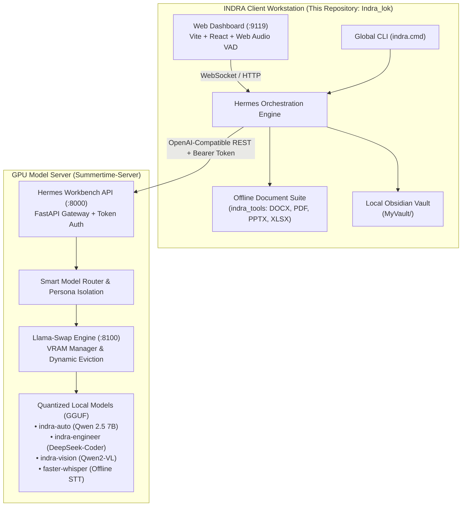

# INDRA GPU Inference Backend & Model Serving Infrastructure

> **Enterprise Architecture Notice**:  
> The high-performance GPU model serving infrastructure, dynamic persona router, and Llama-Swap eviction daemon are maintained in the dedicated backend repository:  
> 🔗 **[Summertime-Server Official Repository](https://github.com/Artyfowl1710/Summertime-server)**

---

## Architecture Topology



---

## Deployment Modes

### Mode A: Distributed Client-Server (Recommended Enterprise Setup)

In distributed mode, the GPU server runs on dedicated hardware (e.g. NVIDIA RTX 4090 / A100 / workstation) and serves one or more analyst workstations over your local network, VPN, or Tailscale.

1. **Deploy Summertime-Server on your GPU Host**:
   ```bash
   git clone https://github.com/Artyfowl1710/Summertime-server.git
   cd Summertime-server
   # Follow server setup in README.md
   powershell -ExecutionPolicy Bypass -File .\start-backend.ps1
   ```

2. **Generate Client Pairing Credentials on Server**:
   ```powershell
   workbench admin export-client
   ```
   *Output will provide the Base URL (e.g. `http://192.168.1.100:8000`) and client API key (`wb_live_...`).*

3. **Pair This Client in One Command**:
   From the root of this `Indra_lok` workspace:
   ```cmd
   indra set-server --url http://192.168.1.100:8000 --key wb_live_your_token_here
   ```
   *The client will automatically verify HTTP latency, fetch all registered models, and update `.env` and `config.yaml`.*

---

### Mode B: Single-Machine All-in-One Setup (Local GPU)

If your client machine has an NVIDIA GPU (6GB+ VRAM) and you wish to run both the client UI and model inference locally:

1. **Clone the Summertime-Server into this directory**:
   ```powershell
   # Run the automated bootstrap script
   .\setup_local_backend.ps1
   ```
   *Or manually:*
   ```bash
   git clone https://github.com/Artyfowl1710/Summertime-server.git temp_backend
   # Copy contents into this directory
   ```

2. **Download Quantized GGUF Models**:
   Place your GGUF models into `models/` (e.g., `qwen2.5-7b-instruct-q4_k_m.gguf`).

3. **Start Local Backend**:
   ```powershell
   powershell -ExecutionPolicy Bypass -File .\start-backend.ps1
   ```

4. **Verify Local Connectivity**:
   ```powershell
   python test_server_connectivity.py
   ```

---

## Connectivity Verification Suite

This folder includes the automated connectivity diagnostic script `test_server_connectivity.py`. Run it at any time to verify server health:

```bash
python test_server_connectivity.py --url http://127.0.0.1:8000 --key wb_live_...
```

Tests performed:
- `[PASS]` Server Root & Docs Reachability
- `[PASS]` Bearer Token Authentication & Scope Check
- `[PASS]` Model Catalog Discovery (`/v1/models`)
- `[PASS]` Live Chat Completion Stream
- `[PASS]` Persona Model Routing Verification
